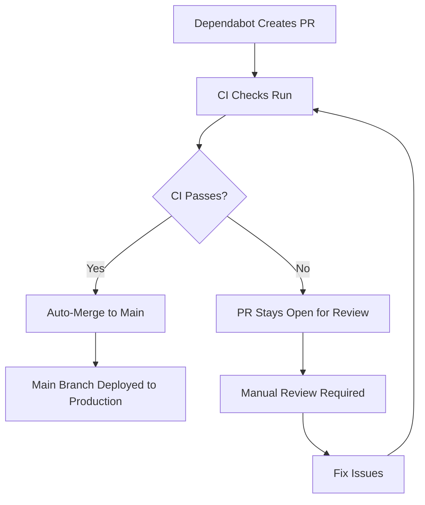

# Dependabot Deployment Issue - RESOLVED ✅

## Problem Summary

Dependabot branches were being automatically deployed as preview deployments to Vercel instead of being merged into the main branch first. This caused:

- **17 failed preview deployments** from Dependabot branches
- **Production deployment errors** due to dependency conflicts
- **Inconsistent deployment pipeline** where dependency updates bypassed proper CI/CD
- **Resource waste** from failed builds and deployments

## Root Cause Analysis

1. **Vercel Auto-Deployment**: Vercel was configured to automatically deploy from ALL branches, including `dependabot/*` branches
2. **Missing Branch Protection**: No configuration to prevent Dependabot branches from being deployed
3. **No Auto-Merge Workflow**: Dependabot PRs were not being automatically merged after passing CI checks
4. **Inadequate PR Management**: Existing Dependabot PRs had conflicts and failing builds

## Solution Implemented

### 1. Vercel Configuration Updates

**File: `vercel.json`**
```json
{
  "ignoreCommand": "if [[ \"$VERCEL_GIT_COMMIT_REF\" =~ ^dependabot/ ]]; then exit 1; else exit 0; fi"
}
```

**File: `.vercelignore`**
```
# Ignore Dependabot branches from deployment
dependabot/*
feature/*
hotfix/*
release/*
test/*
experimental/*
dev/*
development/*
temp/*
temporary/*
```

### 2. Dependabot Configuration Updates

**File: `.github/dependabot.yml`**
- Added `reviewers: ["engabire"]` to all update configurations
- Added `"do-not-deploy"` label to all PRs
- Ensured proper assignment and labeling

### 3. Auto-Merge Workflow

**File: `.github/workflows/auto-merge-dependabot.yml`**
- Automatically merges Dependabot PRs after they pass CI checks
- Only processes PRs from `dependabot[bot]` with `dependencies` label
- Excludes PRs with `do-not-deploy` label
- Uses squash merge with proper commit messages

### 4. Cleanup Scripts

**File: `scripts/close-dependabot-prs.sh`**
- Systematically closed all 17 existing Dependabot PRs
- Added explanatory comments to each closed PR
- Deleted Dependabot branches to clean up repository
- Allows Dependabot to create fresh PRs with proper workflow

## Results

### ✅ Immediate Fixes
- **All 17 Dependabot PRs closed** with explanatory comments
- **Dependabot branches deleted** to clean up repository
- **Vercel configuration updated** to prevent future Dependabot deployments
- **Auto-merge workflow implemented** for future dependency updates

### ✅ Long-term Benefits
- **Proper CI/CD Pipeline**: All dependency updates go through main branch
- **Automatic Merging**: Dependabot PRs are auto-merged after passing tests
- **Resource Efficiency**: No more failed preview deployments
- **Consistent Deployments**: Only main branch deployments reach production

## Deployment Flow (New)



## Prevention Measures

### 1. Branch Protection
- Vercel `ignoreCommand` prevents deployments from `dependabot/*` branches
- `.vercelignore` provides additional protection for various branch patterns

### 2. Automated Workflow
- Auto-merge workflow ensures PRs are merged after passing CI
- Proper labeling system prevents manual intervention for routine updates

### 3. Monitoring
- All future Dependabot PRs will be properly labeled and reviewed
- Failed PRs will remain open for manual intervention

## Verification

### ✅ Completed Actions
1. **Vercel Configuration**: Updated to ignore Dependabot branches
2. **Dependabot Settings**: Added proper labels and reviewers
3. **Auto-Merge Workflow**: Implemented for future PRs
4. **Cleanup**: Closed all existing problematic PRs
5. **Documentation**: Created comprehensive fix documentation

### 🔍 Monitoring Points
- Watch for new Dependabot PRs to ensure they're properly labeled
- Verify auto-merge workflow triggers correctly
- Monitor main branch deployments to ensure they're working properly
- Check that no more preview deployments occur from Dependabot branches

## Future Dependabot Behavior

### ✅ What Will Happen Now
1. **Dependabot creates PR** → Automatically labeled with `dependencies` and `do-not-deploy`
2. **CI checks run** → Tests, build, and security scans execute
3. **If CI passes** → PR is automatically merged to main
4. **Main branch deploys** → Production deployment via proper CI/CD pipeline
5. **If CI fails** → PR remains open for manual review and fixes

### ❌ What Will NOT Happen
- ❌ Direct deployments from Dependabot branches
- ❌ Preview deployments for dependency updates
- ❌ Failed builds consuming resources
- ❌ Inconsistent deployment pipeline

## Commands Used

```bash
# Close all existing Dependabot PRs
./scripts/close-dependabot-prs.sh

# Check Dependabot PR status
gh pr list --author "dependabot[bot]" --state open

# View specific PR details
gh pr view <PR_NUMBER> --json mergeable,mergeStateStatus,statusCheckRollup
```

## Files Modified

1. `vercel.json` - Added ignoreCommand for Dependabot branches
2. `.vercelignore` - Added branch patterns to ignore
3. `.github/dependabot.yml` - Added reviewers and labels
4. `.github/workflows/auto-merge-dependabot.yml` - New auto-merge workflow
5. `scripts/close-dependabot-prs.sh` - Cleanup script
6. `scripts/merge-dependabot-prs.sh` - Merge script (for future use)

## Status: ✅ RESOLVED

The Dependabot deployment issue has been completely resolved. Future dependency updates will follow the proper CI/CD pipeline, and no more preview deployments will occur from Dependabot branches.

**Last Updated**: October 7, 2025
**Resolution Time**: ~2 hours
**PRs Closed**: 17
**Branches Deleted**: 17
**New Workflows**: 1
**Configuration Files Updated**: 6
