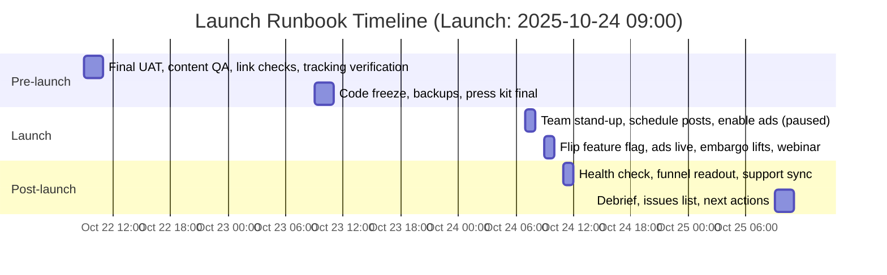

# Runbook Gantt View

```mermaid
gantt
dateFormat  YYYY-MM-DD HH:mm
axisFormat  %b %d %H:%M
title Launch Runbook Timeline (Launch: 2025-10-24 09:00)
section Pre-launch
Final UAT, content QA, link checks, tracking verification :uat, 2025-10-22 09:00, 2025-10-22 11:00
Code freeze, backups, press kit final :freeze, 2025-10-23 09:00, 2025-10-23 11:00
section Launch
Team stand-up, schedule posts, enable ads (paused) :standup, 2025-10-24 07:00, 2025-10-24 08:00
Flip feature flag, ads live, embargo lifts, webinar :launch,  2025-10-24 09:00, 2025-10-24 10:00
section Post-launch
Health check, funnel readout, support sync :health,  2025-10-24 11:00, 2025-10-24 12:00
Debrief, issues list, next actions :debrief, 2025-10-25 09:00, 2025-10-25 11:00
```
